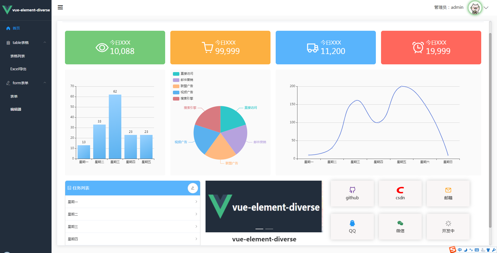

# vue-element-diverse

## 简介

vue-element-diverse专为开发者搭建的模板，让你把时间都放在业务逻辑上，节省搭页面时间，功能区分明确，组件化开发，页面美观简洁，集成多种第三方插件，让你免去百度海底捞针，组件还在持续更新中...


## 模板首页





## 功能

+ 整改echarts代码，调用接口数据替换直即可
+ 数字滚动
+ table表格多选，单选数据，分页
+ table表格excel导出
+ 表单
+ 富文本编辑器

## 体验

```go
# 克隆项目
git clone https://github.com/1164095457/vue-element-diverse.git

# 进入目录
cd vue-element-diverse

# 安装依赖
npm install

# 建议不要用cnpm

# 启动服务
npm run serve
```

